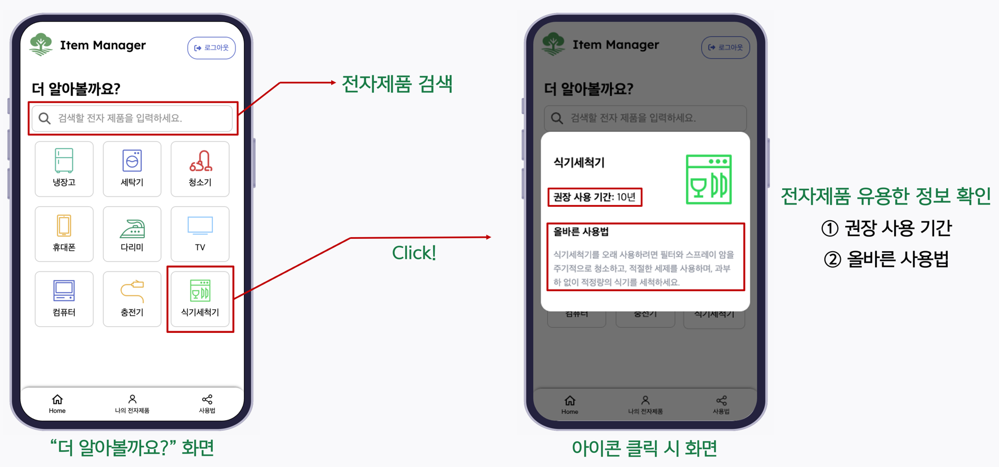
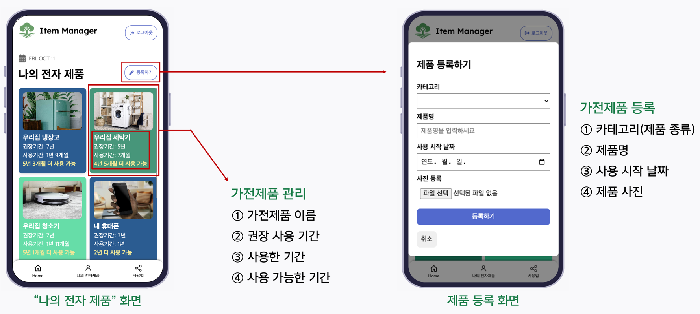

# 🔌 Item Manager (가전제품 수명 관리 서비스)

> **"가전제품의 올바르게 사용하여 지구를 지키는 똑똑한 관리 습관"**
> 올바른 사용법과 교체 시기를 안내하여 전자 폐기물을 줄이는 가전제품 관리 애플리케이션

   

---

## 💡 기획 의도 (Background)

현대 사회에서 수많은 가전제품이 잘못된 관리와 사용법 미숙으로 인해 **권장 수명보다 훨씬 일찍 고장 나고 버려집니다.** 이는 불필요한 지출을 야기할 뿐만 아니라, 심각한 **전자 폐기물(E-waste) 증가**의 원인이 되고 있습니다.

`item-manager`는 이러한 문제를 해결하기 위해 시작되었습니다.
사용자가 자신의 가전제품을 등록하면 **올바른 사용 가이드**를 제공하고, **남은 수명을 시각적으로 추적**하여 제품을 더 오래, 더 안전하게 사용할 수 있도록 돕습니다.

- **Target User**: 가전제품을 보유하고 관리하는 모든 사용자

## ✨ 주요 기능 (Key Features)

| 기능 | 설명                                                                            | 시연 화면                                                |
| :--- |:------------------------------------------------------------------------------|:-----------------------------------------------------|
| **🔍 가전 정보 검색** | 가전제품을 검색하여 **권장 사용 기간**과 **올바른 관리법**을 확인합니다.                                  |  |
| **📱 기기 등록 및 수명 관리** | 보유한 가전제품을 등록하여 리스트를 생성하고, **사용 기간과 남은 수명**을 시각적인 대시보드로 한눈에 파악하여 교체 시기를 관리합니다. |      |
| **🔐 사용자 관리** | 회원가입 및 로그인을 통해 개인화된 기기 목록을 안전하게 관리합니다.                                        |           |

## 🛠 기술 스택 (Tech Stack)

### Frontend
| Tech | Version | Description |
| :--- |:--------| :--- |
| **Vue.js** | 3.4.29  | 사용자 인터페이스 구축 (Composition API 활용) |
| **Vite** | 5.3.1   | 빠른 개발 서버 구동 및 빌드 최적화 |
| **Pinia** | 2.1.7   | 전역 상태 관리 (사용자 세션, 기기 리스트 관리 등) |
| **Node.js / pnpm** | 20.11.0 | 런타임 환경 및 패키지 매니저 |

### Backend
| Tech | Version | Description |
| :--- | :--- | :--- |
| **NestJS** | 10.3.9 | 확장성 있는 서버 애플리케이션 구축 |
| **Prisma** | 5.14.0 | Type-safe한 ORM으로 DB 제어 |
| **Node.js / pnpm** | 20.11.0 | 런타임 환경 및 패키지 매니저 |

### Database
* **PostgreSQL**: 관계형 데이터베이스로 사용자 및 가전 데이터 저장

### Infra & Deployment (On-premise)
* **Raspberry Pi**: 서버 환경 구축 (On-premise)
* **Docker**: 컨테이너 기반의 데이터베이스 운영
* **Nginx**: 리버스 프록시 및 웹 서버
* **pm2**: Node.js 프로세스 관리 및 무중단 운영

## 🏗 아키텍처 (Architecture)

현재 Raspberry Pi를 활용한 온프레미스(On-premise) 환경에서 서비스가 구동됩니다.

### 서비스 아키텍처 
